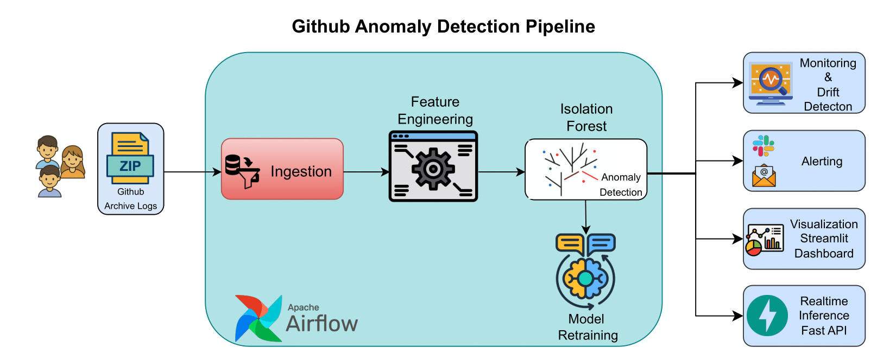

# 🛠️ GitHub Anomaly Detection Pipeline

<span id="motivation"></span>
## 💡 Motivation & Use Case

GitHub hosts an enormous amount of user activity, including pull requests, issues, forks, and stars. Monitoring this activity in real-time is essential for identifying unusual or malicious behavior — such as bots, misuse, or suspicious spikes in contributions. 

This project aims to build a **production-grade anomaly detection system** to:

- Detect abnormal GitHub user behavior (e.g., excessive PRs, bot-like stars)
- Alert maintainers and admins in real time via Slack or email
- Serve anomaly scores via API and support continuous retraining
- Visualize trends, drift, and recent activity using an interactive dashboard

---

A production-grade anomaly detection system for GitHub user behavior using:

- **Apache Airflow** for orchestration  
- **Pandas + Scikit-learn (Isolation Forest)** for modeling and anomaly detection
- **Alerts: Email & Slack** alerting mechanisms for anomaly spikes and data drift
- **FastAPI** for real-time inference  
- **Pytest, Black, Flake8** for testing and linting  
- **Pre-commit + GitHub Actions** for CI/CD and code quality  
- **Streamlit UI** for visualization  
- **Terraform** for infrastructure-as-code provisioning (MLflow)
- **AWS S3** for optional cloud-based storage of features, models, and predictions

#### The full architecture of this GitHub anomaly detection pipeline is illustrated in the diagram below.



---

### A quick [guide](#evaluator-guide) for evaluators to verify all requirements and navigate the implementation easily.

---

## 🤖 Too lazy for copy-pasting commands?

If you're like me and hate typing out commands... good news!  
Just use the **Makefile** to do all the boring stuff for you:

```bash
make help
```

See full Makefile usage [here](#makefile-usage) — from setup to linting, testing, API, Airflow, and Terraform infra!

<span id="project-structure"></span>
## 📦 Project Structure

```java
.
├── dags/                    ← Airflow DAGs for data pipeline and retraining
├── data/                    ← Input datasets (raw, features, processed)
├── models/                  ← Trained ML models (e.g., Isolation Forest)
├── mlruns/                  ← MLflow experiment tracking artifacts
├── infra/                   ← Terraform IaC for provisioning MLflow container
├── github_pipeline/         ← Feature engineering, inference, monitoring scripts
├── tests/                   ← Pytest-based unit/integration tests
├── reports/                 ← Data drift reports (JSON/HTML) from Evidently
├── alerts/                  ← Alert log dumps (e.g., triggered drift/anomaly alerts)
├── notebooks/               ← Jupyter notebooks for exploration & experimentation
├── assets/                  ← Images and architecture diagrams for README
├── .github/workflows/       ← GitHub Actions CI/CD pipelines
├── streamlit_app.py         ← Realtime dashboard for monitoring
├── serve_model.py           ← FastAPI inference service
├── Dockerfile.*             ← Dockerfiles for API and Streamlit services
├── docker-compose.yaml      ← Compose file to run Airflow and supporting services
├── Makefile                 ← Task automation: setup, test, Airflow, Terraform, etc.
├── requirements.txt         ← Python dependencies for Airflow containers
├── Pipfile / Pipfile.lock   ← Python project environment (via Pipenv)
├── .env                     ← Environment variables (Slack, Email, Airflow UID, S3 support flag)
└── README.md                ← 📘 You are here
```

---
<span id="setup-instructions"></span>
## ⚙️ Setup Instructions

### 1. Clone and install dependencies

```bash
git clone https://github.com/rajat116/github-anomaly-project.git
cd github-anomaly-project
pipenv install --dev
pipenv shell
```
### Or install using pip:

```bash
pip install -r requirements.txt
```

<span id="env-config"></span>
### 📄 .env Configuration (Required)

Before running Airflow, you must create a `.env` file in the project root with at least following content:

```env
AIRFLOW_UID=50000
USE_S3=false
```

This is required for Docker to set correct permissions inside the Airflow containers.

#### 🔄 USE_S3 Flag

Set this flag to control where your pipeline reads/writes files:

- USE_S3=false: All files will be stored locally (default, for development and testing)
- USE_S3=true: Files will be written to and read from AWS S3

✅ Required When USE_S3=true

If you enable S3 support, also provide your AWS credentials in the .env:

```bash
AWS_ACCESS_KEY_ID=your_aws_access_key
AWS_SECRET_ACCESS_KEY=your_aws_secret
AWS_REGION=us-east-1
S3_BUCKET_NAME=github-anomaly-logs
```

💡 Tip for Contributors

If you're testing locally or don't have AWS credentials, just keep:

```bash
USE_S3=false
```
This will disable all cloud storage usage and allow you to run the full pipeline locally.

#### Optional (For Email & Slack Alerts)

If you'd like to enable alerts, you can also include the following variables:

```env
# Slack Alerts
SLACK_API_TOKEN=xoxb-...
SLACK_CHANNEL=#your-channel

# Email Alerts
EMAIL_SENDER=your_email@example.com
EMAIL_PASSWORD=your_email_app_password
EMAIL_RECEIVER=receiver@example.com
EMAIL_SMTP=smtp.gmail.com
EMAIL_PORT=587
```
---

### 2. ⚙️ Airflow + 📈 MLflow Integration

This project uses Apache Airflow to orchestrate a real-time ML pipeline and MLflow to track model training, metrics, and artifacts.

#### 🚀 1. Start Airflow & MLflow via Docker

🛠️ Build & Launch

```bash
docker compose build airflow
docker compose up airflow
```

Once up, access:

- Airflow UI: http://localhost:8080 (Login: airflow / airflow)
- MLflow UI: http://localhost:5000

<span id="airflow-dag"></span>
#### ⏱️ 2. Airflow DAGs Overview

- daily_github_inference: Download → Feature Engineering → Inference
- daily_monitoring_dag: Drift checks, cleanup, alerting
- retraining_dag: Triggers model training weekly and logs it to MLflow

<span id="mlflow"></span>
#### 📈 3. MLflow Experiment Tracking

Model training is handled by:

```bash
github_pipeline/train_model.py
```

Each run logs the following:

✅ Parameters:

- timestamp — Training batch timestamp
- model_type — Algorithm used (IsolationForest)
- n_estimators — Number of trees

📊 Metrics

- mean_anomaly_score
- num_anomalies
- num_total
- anomaly_rate

📦 Artifacts

- isolation_forest.pkl — Trained model
- actor_predictions_<timestamp>.parquet
- MLflow Model Registry entry

All experiments are stored in the mlruns/ volume:

```bash
volumes:
  - ./mlruns:/opt/airflow/mlruns
```
You can explore experiment runs and models in the MLflow UI.

### 3. 🧠 Model Training

The model (Isolation Forest) is trained on actor-wise event features:

```bash
python github_pipeline/train_model.py
```
The latest parquet file is used automatically. Model and scaler are saved to models/.

<span id="fastapi"></span>
### 4. 🚀 FastAPI Inference

#### Build & Run

```bash
docker build -t github-anomaly-inference -f Dockerfile.inference .
docker run -p 8000:8000 github-anomaly-inference
```

#### Test the API

```bash
curl -X POST http://localhost:8000/predict \
     -H "Content-Type: application/json" \
     -d '{"features": [12, 0, 1, 0, 4]}'
```

<span id="alerts"></span>
### 5. 📣 Alerts: Email & Slack

This project includes automated alerting mechanisms for anomaly spikes and data drift, integrated into the daily_monitoring_dag DAG.

#### ✅ Triggers for Alerts

- 🔺 Anomaly Rate Alert: If anomaly rate exceeds a threshold (e.g. >10% of actors).
- 🔁 Drift Detection Alert: If feature distributions change significantly over time.

#### 🔔 Notification Channels

- Email alerts (via smtplib)
- Slack alerts (via Slack Incoming Webhooks)

#### 🔧 Configuration

Set the following environment variables in your Airflow setup:

```bash
# .env or Airflow environment
ALERT_EMAIL_FROM=your_email@example.com
ALERT_EMAIL_TO=recipient@example.com
ALERT_EMAIL_PASSWORD=your_email_app_password
ALERT_EMAIL_SMTP=smtp.gmail.com
ALERT_EMAIL_PORT=587

SLACK_WEBHOOK_URL=https://hooks.slack.com/services/XXX/YYY/ZZZ
```
🛡️ Email app passwords are recommended over actual passwords for Gmail or Outlook.

#### 📁 Alert Script

Logic is handled inside:

```bash
github_pipeline/monitor.py
alerts/alerting.py
```

These generate alert messages and send them through email and Slack if thresholds are breached.

<span id="ci_cd"></span>
### 6. ✅ CI/CD with GitHub Actions

The .github/workflows/ci.yml file runs on push:

- ✅ black --check
- ✅ flake8 (E501,W503 ignored)
- ✅ pytest
- ✅ (optional) Docker build

### 7. 🔍 Code Quality

Pre-commit hooks ensure style and linting:

```bash
pre-commit install
pre-commit run --all-files
```

Configured via:

- .pre-commit-config.yaml
- .flake8 (ignore = E501)

<span id="testing"></span>
### 8. 🧪 Testing

This project includes both unit tests and a full integration test to ensure end-to-end pipeline functionality.

Run all tests:

```bash
PYTHONPATH=. pytest
```

#### All tests will automatically run under tests/ including:

Unit tests for:

- Inference API (serve_model.py)
- Feature engineering (feature_engineering.py)
- Model training logic (train_model.py)

Integration test (test_pipeline_integration.py) for:

- End-to-end flow using latest available local data:
- processed → feature engineering → model inference

💡 These tests are also automatically run via pre-commit and GitHub Actions.

### 9. 📊 Streamlit Dashboard

The project includes an optional interactive Streamlit dashboard to visualize:

- ✅ Latest anomaly predictions
- 📈 Data drift metrics from the Evidently report
- 🧑‍💻 Top actors based on GitHub activity
- ⏱️ Activity summary over the last 48 hours

#### 🔧 How to Run Locally

Make sure you have installed all dependencies via Pipenv, then launch the Streamlit app:

```bash
streamlit run streamlit_app.py
```

Once it starts, open the dashboard in your browser at:

```bash
http://localhost:8501
```

The app will automatically load:

- The latest prediction file from data/features/
- The latest drift report from reports/

Note: If these files do not exist, the dashboard will show a warning or empty state. You can generate them by running the Airflow pipeline or the monitoring scripts manually.

#### 🐳 Optional: Run via Docker

You can also build and run the dashboard as a container (if desired):

Build the image:

```bash
docker build -t github-anomaly-dashboard -f Dockerfile.streamlit .
```

Run the container:

```bash
docker run -p 8501:8501 \
  -v $(pwd)/data:/app/data \
  -v $(pwd)/reports:/app/reports \
  github-anomaly-dashboard
```

Then open your browser at http://localhost:8501.

### 11. ☁️ Infrastructure as Code (IaC): MLflow Server with Terraform

This Terraform module provisions a **Docker-based MLflow tracking server**, matching the setup used in `docker-compose.yaml`, but on a **different port (5050)** to avoid conflicts.

---

#### 📁 Directory Structure

- infra/main.tf # Terraform configuration
- README.md # This file

#### ⚙️ Requirements

- [Terraform](https://developer.hashicorp.com/terraform/downloads)
- [Docker](https://docs.docker.com/get-docker/)

#### 🚀 How to Use:

##### 1. Navigate to the `infra/` folder

```bash
cd infra
```

##### 2. Initialize Terraform

```bash
terraform init
```

##### 3. Apply the infrastructure

```bash
terraform apply # Confirm with yes when prompted.
```

##### 4. 🔎 Verify

MLflow server will be available at:

```bash
http://localhost:5050
```

All artifacts will be stored in your project’s mlruns/ directory.

##### 5. ❌ To Clean Up

```bash
terraform destroy
```

This removes the MLflow container provisioned by Terraform.

### 12. 🧹 Clean Code

All code follows:

- PEP8 formatting via Black
- Linting with Flake8 + Bugbear
- Pre-commit hook enforcement

<span id="makefile-usage"></span>
### 13. 🛠️ Makefile Usage

This project includes a Makefile that simplifies formatting, testing, building Docker containers, and running Airflow or the FastAPI inference app.

You can run all commands with or without activating the Pipenv shell. For example:

```bash
make lint
```

#### 🔧 Setup Commands

```bash
make install # Install all dependencies via Pipenv (both runtime and dev)
make create-env   # Create .env file with AIRFLOW_UID, alert placeholders, and S3 support flag
make clean # Remove all __pycache__ folders and .pyc files
```

<span id="code-quality"></span>
#### 🧪 Code Quality & Testing

```bash
make format # Format code using Black
make lint # Lint code using Flake8
make test # Run tests using Pytest
make check # Run all of the above together
```

### 📊 Streamlit Dashboard

```bash
make streamlit  # Launch the Streamlit dashboard at http://localhost:8501
```

#### 🐳 FastAPI Inference App

```bash
make docker-build # Build the Docker image for FastAPI app
make docker-run # Run the Docker container on port 8000
make api-test	# Send a test prediction request using curl
```

After running make docker-run, open another terminal and run make api-test.

#### ⏱️ Airflow Pipeline

```bash
make airflow-up # Start Airflow services (scheduler, UI, etc.)
make airflow-down	Stop all Airflow containers
```

Once up, access:

- Airflow UI: http://localhost:8080 (Login: airflow / airflow)
- MLflow UI: http://localhost:5000

### MLflow Server with Terraform

```bash
make install-terraform # Install Terraform CLI if not present
make terraform-init    # Initialize Terraform config
make terraform-apply   # Provision MLflow container (port 5050)
make terraform-destroy # Tear down MLflow container
make terraform-status  # Show current infra state
```

#### 📋 View All Commands

```bash
make help # Prints a summary of all available targets and their descriptions.
```

### 14. 🙌 Credits

Built by Rajat Gupta as part of an MLOps portfolio.
Inspired by real-time event pipelines and anomaly detection architectures used in production.

### 15. 📝 License

<span id="evaluator-guide"></span>
### 16. ✅ Evaluation Criteria for MLOps Zoomcamp

Each criterion below links to the relevant section of this README to help evaluators verify the implementation easily.

#### 🧠 Problem Description — 2 points

✅ The project clearly defines the problem of detecting anomalous GitHub activity using real-time machine learning. See [here](#motivation)

#### ☁️ Cloud — 4 points

✅ The project runs in GitHub Codespaces and supports AWS S3 with a USE_S3 toggle. See [here](#env-config)

#### 📈 Experiment Tracking & Model Registry — 4 points

✅ MLflow is fully integrated to track experiments and register models. See [here](#mlflow)

#### 🛠️ Workflow Orchestration — 4 points

✅ Uses Apache Airflow with 3 deployed DAGs for inference, monitoring, and retraining. See [here](#airflow-dag)

#### 🚀 Model Deployment — 4 points

✅ Model is served via FastAPI and fully containerized for deployment. See [here](#fast-api)

#### 📊 Model Monitoring — 4 points

✅ Implements drift detection, anomaly thresholding, and sends alerts via Slack and Email. See [here](#alerts)

#### ♻️ Reproducibility — 4 points

✅ The project is fully reproducible with clear instructions, dependency locking, and data structure. See [here](#setup)

#### ✅ Best Practices — 7 points

- **Unit tests**: Pytest-based unit tests on core components. See [here](#testing)
- **Integration test**: Full integration test to validate the entire pipeline. See [here](#testing)
- **Linter & Code formatter**: Uses Black and Flake8 with Makefile targets and pre-commit hooks. See [here](#code-quality)
- **Makefile**: Includes targets for install, lint, test, format, build, and airflow. See [here](#makefile-usage)
- **Pre-commit hooks**: Automatically formats and checks code before commits. See [here](#code-quality)
- **CI/CD pipeline**: GitHub Actions run tests, lint, and build containers on push. See [here](#ci_cd)